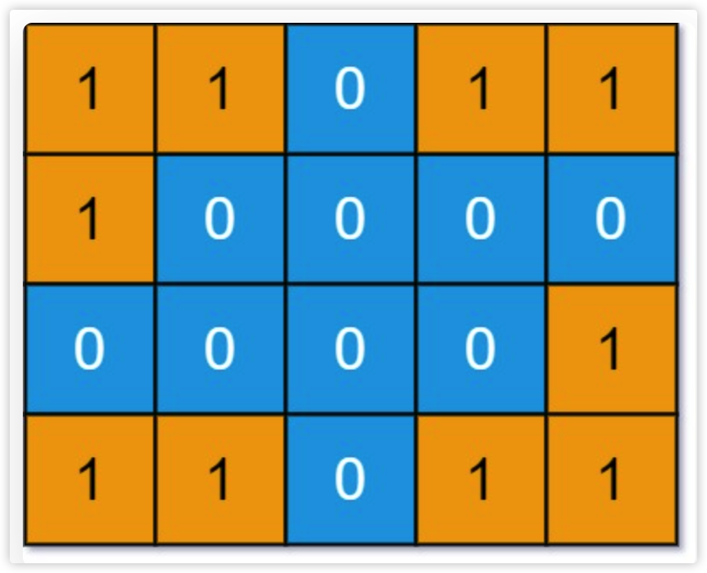

## 概览

- 岛屿系列题目的核心考点就是用 DFS/BFS 算法遍历二维数组。
- 如何在二维矩阵中使用 DFS 搜索呢？如果你把二维矩阵中的每一个位置看做一个节点，这个节点的上下左右四个位置就是相邻节点，
  那么整个矩阵就可以抽象成一幅网状的「图」结构

## ref
https://labuladong.github.io/algo/4/31/108/

## 二维矩阵的 DFS 代码框架

```
// 二叉树遍历框架
void traverse(TreeNode root) {
    traverse(root.left);
    traverse(root.right);
}
// 二维矩阵遍历框架
void dfs(int[][] grid, int i, int j, boolean[][] visited) {
    int m = grid.length, n = grid[0].length;
    if (i < 0 || j < 0 || i >= m || j >= n) {
        // 超出索引边界
        return;
    }
    if (visited[i][j]) {
        // 已遍历过 (i, j)
        return;
    }
    // 进入节点 (i, j)
    visited[i][j] = true;
    dfs(grid, i - 1, j, visited); // 上
    dfs(grid, i + 1, j, visited); // 下
    dfs(grid, i, j - 1, visited); // 左
    dfs(grid, i, j + 1, visited); // 右
}
```

- 因为二维矩阵本质上是一幅「图」，所以遍历的过程中需要一个 visited 布尔数组防止走回头路，
  如果你能理解上面这段代码，那么搞定所有岛屿系列题目都很简单。

## 示例：

### 例1: leetcode200:岛屿数量


如下图所示：有4个岛屿

- 脚本文件


### 例2：leetcode1254:封闭岛屿的数量

- 上一题说二维矩阵四周可以认为也是被海水包围的，所以靠边的陆地也算作岛屿。
- 主要理解这一题是：”靠边的陆地不算作「封闭岛屿」“
- 所以将边缘的岛屿排除掉，也就是变成海，那就可以了

- 脚本文件
  

### 例3：leetcode1020:飞地的数量

- 这一题是统计陆地的面积
- 思路跟上一题一样，先将边缘的陆地淹掉，然后递归将它临边的也淹了
- 最后grid上剩下的1就是满足题意的陆地，再使用循环遍历就能得到面积值
- 注意这题跟上一题的区别：上一题在遍历的时候，会将经过的地方都淹掉，而这一题不会淹没符合题意的陆地

- 脚本文件
  

### 例4：leetcode695:岛屿的最大面积

- 这一题算是上一题的扩展，求各个岛屿中的最大面积
- 需要在 dfs 淹没岛屿的同时，记录这个岛屿的面积，也就是在遍历的时候，找到符合题意的陆地，然后开始淹它周围陆地的时候，顺便记录面积和
- 这里不需要边界处理，也就是边缘上的陆地也需要被考虑

- 脚本文件
  
